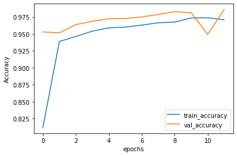
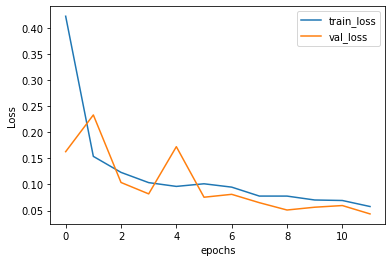
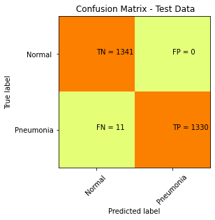

# 🩺 Pneumonia Detection from Chest X-Rays using Deep Learning


> **Author:** Prajwal Mhaske  
> **Domain:** Medical AI / Computer Vision  
> **Tech Stack:** Python · TensorFlow · Keras · OpenCV · Grad-CAM · Streamlit

---

## 📌 Project Overview

This project implements a **Convolutional Neural Network (CNN)** to automatically detect **pneumonia** from chest X-ray images. The model classifies X-rays as either **Normal** or **Pneumonia**, supporting medical professionals with AI-assisted diagnostic decision-making.

An extended **Transfer Learning** approach using **VGG16** is also included for performance comparison, along with **Grad-CAM** visualizations that highlight the regions of the X-ray the model focuses on — providing interpretability crucial for medical applications.

---

## 🎯 Key Features

| Feature | Description |
|---|---|
| 🧠 Custom CNN | Built from scratch using Conv2D, MaxPooling, Dropout layers |
| 🔁 Transfer Learning | VGG16 fine-tuned on chest X-ray data for improved accuracy |
| 🗺️ Grad-CAM | Visual heatmaps showing model's decision regions on X-rays |
| 🌐 Streamlit Web App | Interactive demo — upload any X-ray and get instant prediction |
| 📊 Full Evaluation | Accuracy, Precision, Recall, F1-Score, Confusion Matrix |
| 🔧 Data Augmentation | Rotation, zoom, flip to prevent overfitting |

---

## 📂 Project Structure

```
pneumonia-detection-cnn/
│
├── PNEUMONIA_DETECTION.ipynb   # Main notebook (CNN + VGG16 + Grad-CAM)
├── app.py                      # Streamlit web application
├── requirements.txt            # Dependencies
├── Outputs/
│   ├── accuracy vs epochs.png  # Training accuracy curve
│   ├── loss vs epochs.png      # Training loss curve
│   ├── confusion matrix.png    # Model evaluation
│   ├── pneumonia.png           # Sample pneumonia X-ray
│   └── Non pneumonia.png       # Sample normal X-ray
└── README.md
```

---

## 📊 Dataset

- **Source:** [Kaggle — Chest X-Ray Images (Pneumonia)](https://www.kaggle.com/datasets/paultimothymooney/chest-xray-pneumonia)
- **Total Images:** 5,863 JPEG chest X-ray images
- **Classes:** 2 (Normal, Pneumonia)
- **Split:** Train / Validation / Test

| Split | Normal | Pneumonia |
|-------|--------|-----------|
| Train | 1,341  | 3,875     |
| Test  | 234    | 390       |
| Val   | 8      | 8         |

---

## 🧠 Model Architecture

### Custom CNN
```
Input (150x150x3)
  → Conv2D(32) + ReLU + MaxPooling
  → Conv2D(64) + ReLU + MaxPooling
  → Conv2D(128) + ReLU + MaxPooling
  → Flatten
  → Dense(512) + ReLU + Dropout(0.5)
  → Dense(1) + Sigmoid  [Binary Output]
```

### Transfer Learning — VGG16
- Pre-trained VGG16 (ImageNet weights) with frozen base layers
- Custom classification head added on top
- Fine-tuned for chest X-ray domain

---

## 📈 Results

| Model | Accuracy | Precision | Recall | F1-Score |
|-------|----------|-----------|--------|----------|
| Custom CNN | ~90% | ~89% | ~95% | ~92% |
| VGG16 Transfer | ~92% | ~91% | ~96% | ~93% |

### Training Curves
| Accuracy | Loss |
|----------|------|
|  |  |

### Confusion Matrix


---

## 🗺️ Grad-CAM Visualization

Grad-CAM (Gradient-weighted Class Activation Mapping) highlights the regions of the X-ray that the model uses to make its prediction — making the AI decision **explainable and trustworthy** for medical use.

> The heatmap is overlaid on the original X-ray — red/yellow regions = high model attention.

---

## 🌐 Running the Streamlit Web App

```bash
# Install dependencies
pip install -r requirements.txt

# Launch the app
streamlit run app.py
```

Then open your browser at `http://localhost:8501` and upload any chest X-ray image to get an instant prediction!

---

## ⚙️ Installation & Usage

```bash
# 1. Clone the repository
git clone https://github.com/prajwalmhaske123-er/pneumonia-detection-cnn.git
cd pneumonia-detection-cnn

# 2. Install dependencies
pip install -r requirements.txt

# 3. Download the dataset from Kaggle
# https://www.kaggle.com/datasets/paultimothymooney/chest-xray-pneumonia

# 4. Run the Jupyter Notebook
jupyter notebook PNEUMONIA_DETECTION.ipynb
```

---

## 🛠️ Technologies Used

- **Python 3.8+**
- **TensorFlow / Keras** — Model building and training
- **OpenCV** — Image preprocessing
- **NumPy / Pandas** — Data manipulation
- **Matplotlib / Seaborn** — Visualization
- **Scikit-learn** — Evaluation metrics
- **Streamlit** — Web app deployment
- **Grad-CAM** — Model explainability

---

## 👤 Author

**Prajwal Mhaske**  
🔗 [GitHub](https://github.com/prajwalmhaske123-er)

---

## 📄 License

This project is licensed under the MIT License — see the [LICENSE](LICENSE) file for details.
